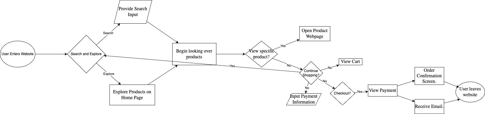

# sp26-cse110-lab4

## 📂 Project Structure

* **[expose/](https://github.com/pranavganesan/sp26-cse110-lab4/tree/main/expose)**: JavaScript scoping and CI/CD logic.
* **[explore/devtools/](https://github.com/pranavganesan/sp26-cse110-lab4/tree/main/explore/devtools)**: Chrome DevTools debugging reports and screenshots.
* **[explore/diagramming/](https://github.com/pranavganesan/sp26-cse110-lab4/tree/main/explore/diagramming)**: Retail shop logic flowchart.
* **[expand/screenshots/](https://github.com/pranavganesan/sp26-cse110-lab4/tree/main/expand/screenshots)**: Visual evidence of the debugging process.

## 📊 Logic Flowchart
Below is the system roadmap for the simplified retail shop:

